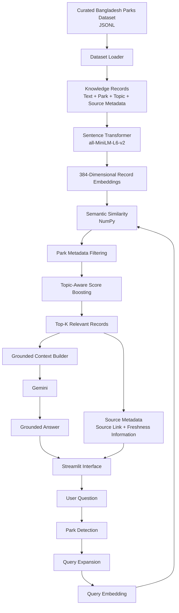

# 🇧🇩🌿 ParkWise Bangladesh

**ParkWise Bangladesh** is a Retrieval-Augmented Generation (RAG) application for exploring information about Bangladesh national parks.

The system searches a custom-curated knowledge base derived from Bangladesh Forest Department and Bangladesh Forest Information System (BFIS) materials before generating an answer with Gemini.

The project was built from scratch as a learning-focused RAG implementation, with explicit document retrieval, metadata filtering, query expansion, topic-aware ranking, evaluation, grounded generation, and source transparency.

---

## 🚀 Live Demo

> Add the Streamlit deployment URL here after deployment.

---

## ✨ Features

* 🇧🇩 Bangladesh-focused national park knowledge base
* 🔎 Semantic retrieval using Sentence Transformers
* 🧠 `all-MiniLM-L6-v2` embeddings
* 📐 384-dimensional text embeddings
* 🏞️ Automatic park detection
* 🧩 Metadata filtering
* 🔤 Query expansion
* 🎯 Topic-aware score boosting
* 🤖 Gemini-powered grounded answer generation
* 📚 Original source information
* 🔗 Links to Forest Department/BFIS sources
* 🕒 Freshness warnings for historical management sources
* 💬 Streamlit chat interface
* 🔧 Developer retrieval-debug mode
* 🗑️ Clear-chat functionality
* 🧪 Automated retrieval evaluation

---

# 🌳 Supported Parks

The current version includes information for:

* **Lawachara National Park**
* **Satchari National Park**
* **Bhawal National Park**

The knowledge base contains curated records covering subjects such as:

* wildlife
* birds
* biodiversity
* forest type
* location
* access
* visitor facilities
* communities
* conservation
* ecotourism
* management
* threats
* biodiversity monitoring

---

# 🧠 What is RAG?

Retrieval-Augmented Generation improves an LLM response by first retrieving relevant information from a trusted knowledge base.

Instead of sending only this:

```text
User Question
      ↓
     LLM
      ↓
   Answer
```

ParkWise uses:

```text
User Question
      ↓
Search Knowledge Base
      ↓
Retrieve Relevant Records
      ↓
Question + Retrieved Evidence
      ↓
Gemini
      ↓
Grounded Answer + Sources
```

This makes the model less dependent on general training knowledge and allows ParkWise to show where its information came from.

---

# 🏗️ System Architecture



---

# 🔄 RAG Pipeline

## 1. Custom Knowledge Dataset

ParkWise uses a custom JSONL dataset rather than sending entire PDFs directly to the LLM.

Each record contains structured metadata similar to:

```json
{
  "id": "bhawal_04",
  "park": "Bhawal National Park",
  "country": "Bangladesh",
  "topic": "wildlife",
  "text": "Forest Department information reports...",
  "source_title": "Bhawal National Park — Bangladesh Forest Department",
  "source_url": "...",
  "source_year": null,
  "source_type": "official_webpage",
  "freshness_note": "Official source..."
}
```

This provides the retriever with both semantic text and structured metadata.

---

## 2. Embedding Generation

ParkWise uses:

```text
all-MiniLM-L6-v2
```

to convert each knowledge record into a:

```text
384-dimensional vector
```

Semantically related questions and records should have similar vector representations.

---

## 3. Park Detection

When a query explicitly names a park, ParkWise identifies it.

Example:

```text
Where is Lawachara National Park?

             ↓

Detected park:
Lawachara National Park
```

This enables metadata filtering.

---

## 4. Query Expansion

ParkWise expands certain query types with related terms.

For example:

```text
What animals live in Bhawal?
```

can be expanded with concepts such as:

```text
wildlife
animals
mammals
birds
reptiles
amphibians
biodiversity
```

This helps when user wording differs from the dataset wording.

---

## 5. Semantic Retrieval

The expanded query is converted into an embedding.

The query vector is compared with record embeddings using normalized vector similarity with NumPy.

---

## 6. Metadata Filtering

If a park is detected, unrelated parks can be removed from the candidate set.

```text
Question mentions Bhawal

          ↓

Search Bhawal records

          ↓

Exclude Lawachara
Exclude Satchari
```

---

## 7. Topic-Aware Ranking

ParkWise applies lightweight topic boosts.

For example, a question containing:

```text
visitor facilities
```

gives additional ranking weight to records tagged:

```text
facilities
```

Likewise, wildlife, forest type, access, location, conservation, management, communities, threats, ecotourism, and monitoring have topic-aware ranking rules.

The final retrieval score therefore combines:

```text
Semantic Similarity
        +
Metadata Filtering
        +
Topic-Aware Boosting
```

---

## 8. Top-K Retrieval

The highest-scoring records are selected and passed to the generation stage.

ParkWise currently retrieves up to:

```text
Top 5 records
```

---

## 9. Grounded Gemini Generation

The retrieved evidence is transformed into a context prompt for Gemini.

The model is instructed to:

* answer only from supplied context
* avoid inventing information
* state when the dataset is insufficient
* distinguish historical management material from live visitor information
* avoid inventing current prices, closures, schedules, or regulations

---

## 10. Source Transparency

ParkWise displays:

* park
* topic
* source title
* source year
* retrieval relevance
* freshness warning
* original source link

Developer Debug Mode additionally shows:

* record ID
* retrieved text
* exact retrieval score
* retrieval ranking

---

# 🧪 Retrieval Evaluation

ParkWise includes an automated evaluation script using a custom benchmark of **18 questions**.

Current controlled benchmark results:

| Metric                   |           Result |
| ------------------------ | ---------------: |
| Top-1 Retrieval Accuracy | **18/18 — 100%** |
| Top-3 Retrieval Accuracy | **18/18 — 100%** |

Top-1 accuracy checks whether the expected park/topic is the first retrieved result.

Top-3 accuracy checks whether the expected park/topic appears anywhere in the first three retrieved results.

### Important

This is a small, curated benchmark created for this project's knowledge base. The 100% result should not be interpreted as 100% accuracy for arbitrary unseen questions.

A future version should include a larger hold-out evaluation set with independently written queries.

---

# 📁 Project Structure

```text
ParkWise-AI/
│
├── app.py
├── README.md
├── requirements.txt
├── .gitignore
│
├── data/
│   ├── bd_parks_rag_corpus.jsonl
│   └── bd_parks_eval_questions.jsonl
│
├── src/
│   ├── dataset_loader.py
│   ├── retriever.py
│   ├── evaluate_retrieval.py
│   └── rag.py
│
└── legacy_pdf_pipeline/
    ├── pdf_loader.py
    ├── chunker.py
    └── embeddings.py
```

---

# 🛠️ Technology Stack

| Component              | Technology                |
| ---------------------- | ------------------------- |
| Programming language   | Python                    |
| UI                     | Streamlit                 |
| Embeddings             | Sentence Transformers     |
| Embedding model        | all-MiniLM-L6-v2          |
| Similarity calculation | NumPy                     |
| LLM                    | Gemini                    |
| API SDK                | Google GenAI              |
| Local secrets          | python-dotenv             |
| Data format            | JSONL                     |
| Deployment             | Streamlit Community Cloud |
| Version control        | Git + GitHub              |

---

# ⚙️ Local Setup

## Clone

```bash
git clone https://github.com/cloud-pantheon/ParkWise-AI.git
cd ParkWise-AI
```

## Create virtual environment

Windows:

```powershell
python -m venv .venv
.venv\Scripts\Activate.ps1
```

macOS/Linux:

```bash
python -m venv .venv
source .venv/bin/activate
```

## Install dependencies

```bash
python -m pip install -r requirements.txt
```

## Add Gemini API key

Create:

```text
.env
```

Add:

```text
GEMINI_API_KEY=your_api_key_here
```

Never commit this file.

## Start the application

```bash
python -m streamlit run app.py
```

---

# 🧪 Run Retrieval Evaluation

```bash
python src/evaluate_retrieval.py
```

Example result:

```text
Total Questions: 18

Top-1 Accuracy: 18/18 (100.0%)
Top-3 Accuracy: 18/18 (100.0%)
```

---

# 💬 Example Questions

```text
What animals live in Bhawal National Park?
```

```text
Where is Lawachara National Park?
```

```text
What visitor facilities are available at Satchari?
```

```text
What type of forest is Bhawal National Park?
```

```text
How is biodiversity monitored in Satchari?
```

```text
What conservation problems affect Bhawal?
```

---

# 🔐 Security

The Gemini API key is never stored directly in application source code.

For local development:

```text
.env
```

is excluded through `.gitignore`.

For Streamlit Community Cloud, the key should be entered through Streamlit's Secrets configuration.

If an API key is accidentally committed to GitHub, it should be revoked and replaced immediately.

---

# ☁️ Deployment

ParkWise Bangladesh is designed for Streamlit Community Cloud.

Deployment configuration:

```text
Repository:
cloud-pantheon/ParkWise-AI

Branch:
main

Entrypoint:
app.py
```

Add this secret in Streamlit Community Cloud:

```toml
GEMINI_API_KEY = "YOUR_GEMINI_API_KEY"
```

Do not upload `.env` to GitHub.

---

# ⚠️ Limitations

Current limitations include:

* only three Bangladesh national parks
* a relatively small curated dataset
* embeddings are generated when the application initializes
* no persistent vector database
* no neural reranker
* no BM25 search engine
* benchmark is small and curated
* historical management documents may not represent current visitor conditions
* live information such as weather, ticket prices, closures, opening hours, and transportation is not currently retrieved
* Gemini availability can affect answer generation

---

# 🚀 Future Improvements

Potential Version 2 features:

* additional Bangladesh national parks
* persistent FAISS or Qdrant vector index
* BM25 + vector hybrid search
* reranking model
* larger unseen evaluation set
* automated RAG evaluation metrics
* live weather integration
* map integration
* current park-status retrieval
* multilingual Bangla/English queries
* Bangla answer generation
* conversational query rewriting
* user document upload
* citation-level evidence highlighting
* agentic RAG with live information tools

---

# 🎯 Learning Outcomes

This project demonstrates experience with:

* Retrieval-Augmented Generation
* custom dataset creation
* embeddings
* semantic search
* cosine similarity
* metadata filtering
* query expansion
* ranking heuristics
* retrieval evaluation
* grounded prompting
* API integration
* secret management
* Streamlit application development
* Git/GitHub
* cloud deployment

---

## Disclaimer

ParkWise Bangladesh is an educational project and is not affiliated with or endorsed by the Bangladesh Forest Department or BFIS.

Some source materials are historical management documents. Current park conditions, fees, regulations, operating hours, closures, and safety information should always be verified using current official sources.
