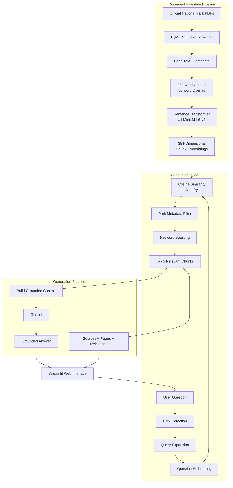

# 🏞️ ParkWise AI

**ParkWise AI** is a beginner-friendly Retrieval-Augmented Generation (RAG) application that answers questions about U.S. National Parks using information retrieved from official park documents.

Instead of asking a language model to answer from general knowledge, ParkWise first searches its local document collection, retrieves the most relevant passages, and provides those passages to Gemini as context for a grounded response.

The project was built from scratch to demonstrate the core stages of a RAG pipeline without hiding the retrieval process behind a large RAG framework.

---

## ✨ Features

* 📄 Extracts text from official park PDF documents
* ✂️ Splits documents into overlapping text chunks
* 🧠 Generates semantic embeddings with Sentence Transformers
* 🔎 Performs semantic similarity search
* 🏞️ Filters retrieval by detected national park
* 🔤 Uses query expansion and keyword boosting
* 🤖 Generates grounded responses with Gemini
* 📚 Displays document and page sources
* 🎯 Shows retrieval relevance scores
* 💬 Provides a Streamlit chat interface
* 🧪 Includes an optional retrieval debug mode
* 🗑️ Supports clearing conversation history
* 🛡️ Handles temporary AI API failures gracefully

---

# 🧠 What is RAG?

Retrieval-Augmented Generation combines information retrieval with a Large Language Model.

Instead of sending only a user's question to the LLM, ParkWise first searches trusted documents for relevant information.

The retrieved text becomes additional context for the model.

```text
User Question
      ↓
Retrieve Relevant Information
      ↓
Provide Question + Context to LLM
      ↓
Generate Grounded Answer
```

This reduces the need for the model to rely entirely on its general training knowledge.

---

# 🏗️ System Architecture



---

# 🔄 End-to-End RAG Pipeline

ParkWise follows these stages:

### 1. Document Loading

Official park PDF files are loaded using **PyMuPDF**.

Each extracted page keeps metadata such as:

```python
{
    "source": "redwood.pdf",
    "page": 2,
    "text": "..."
}
```

Keeping metadata allows ParkWise to show the user where retrieved information came from.

---

### 2. Chunking

Large PDF pages are divided into smaller pieces.

Current configuration:

```text
Chunk size: 250 words
Overlap: 50 words
```

Overlap helps prevent information from being lost when an important sentence appears near the boundary between two chunks.

---

### 3. Embeddings

Each chunk is converted into a numerical vector using:

```text
all-MiniLM-L6-v2
```

Each embedding contains:

```text
384 dimensions
```

Semantically similar pieces of text should have similar vector representations.

---

### 4. Query Processing

When a user asks a question, ParkWise performs several preprocessing steps.

For example:

```text
Can I bring my pets to Redwood Park?
```

ParkWise can detect:

```text
Target park → Redwood
Topic → pets
```

The query can also be expanded with related terms such as:

```text
pets
dogs
allowed
prohibited
leash
restrained
trails
```

This improves retrieval when the user's wording differs from the wording in the source document.

---

### 5. Semantic Retrieval

The user's question is converted into the same 384-dimensional embedding representation.

ParkWise compares the query vector against document vectors using normalized vector similarity.

The implementation currently uses **NumPy** for the similarity calculation.

---

### 6. Metadata Filtering

If the question clearly identifies a park, ParkWise filters unrelated park documents.

For example:

```text
Question:
Can I bring pets to Redwood Park?

                ↓

Search:
redwood.pdf

Not:
mount_rainier.pdf
rocky_mountain.pdf
```

This improves retrieval precision.

---

### 7. Keyword Boosting

Semantic similarity is combined with lightweight keyword matching.

This creates a simple hybrid retrieval strategy:

```text
Semantic Similarity
        +
Keyword Matching
        +
Park Metadata Filtering
        ↓
Ranked Results
```

---

### 8. Top-K Retrieval

ParkWise currently selects the top:

```text
5 chunks
```

These chunks become the evidence supplied to the language model.

---

### 9. Grounded Generation

The retrieved chunks and user question are sent to Gemini.

The prompt instructs the model to:

* answer only from the supplied document context
* avoid inventing information
* state when the documents do not contain enough information
* avoid fabricating sources or page numbers

---

### 10. Source Display

ParkWise displays source information alongside answers, including:

```text
🌿 Redwood National & State Parks
📄 Page 2
🎯 Retrieval relevance score
```

A developer debug mode can also display the complete retrieved chunks.

---

# 📚 Current Knowledge Base

ParkWise Version 1 currently uses documents for:

* 🌲 Redwood National & State Parks
* 🌋 Mount Rainier National Park
* 🏔️ Rocky Mountain National Park

The documents were collected from official National Park Service sources.

---

# 🛠️ Technology Stack

| Area                  | Technology                |
| --------------------- | ------------------------- |
| Language              | Python                    |
| Frontend              | Streamlit                 |
| PDF Processing        | PyMuPDF                   |
| Embeddings            | Sentence Transformers     |
| Embedding Model       | all-MiniLM-L6-v2          |
| Similarity Search     | NumPy                     |
| Generation            | Gemini                    |
| Gemini SDK            | Google GenAI              |
| Environment Variables | python-dotenv             |
| Deployment            | Streamlit Community Cloud |
| Version Control       | Git / GitHub              |

---

# 📁 Project Structure

```text
parkwise-rag/
│
├── app.py
│
├── README.md
│
├── requirements.txt
│
├── .gitignore
│
├── .env                 # local only — never commit
│
├── data/
│   ├── mount_rainier.pdf
│   ├── redwood.pdf
│   └── rocky_mountain.pdf
│
└── src/
    ├── pdf_loader.py
    ├── chunker.py
    ├── embeddings.py
    ├── retriever.py
    └── rag.py
```

---

# ⚙️ Local Installation

## 1. Clone the Repository

```bash
git clone <your-repository>
cd parkwise-rag
```

## 2. Create a Virtual Environment

Windows:

```bash
python -m venv .venv
.venv\Scripts\Activate.ps1
```

macOS/Linux:

```bash
python -m venv .venv
source .venv/bin/activate
```

## 3. Install Dependencies

```bash
python -m pip install -r requirements.txt
```

## 4. Configure the Gemini API Key

Create:

```text
.env
```

Add:

```text
GEMINI_API_KEY=your_api_key_here
```

Never commit this file to GitHub.

## 5. Start ParkWise

```bash
python -m streamlit run app.py
```

Then open the local Streamlit address shown in the terminal.

---

# 🔐 Security

ParkWise keeps the Gemini API key outside the source code.

Local development uses:

```text
.env
```

The `.env` file is excluded through `.gitignore`.

Production deployments should use the hosting platform's secret-management system rather than storing API keys in the repository.

If an API key is ever accidentally committed to a public repository, the key should be revoked or rotated immediately.

---

# ☁️ Deployment

The application is designed for Streamlit Community Cloud.

Deployment requires:

```text
app.py
requirements.txt
data/
src/
```

The Gemini API key must be added through Streamlit's deployment secrets rather than committed to GitHub.

Example secret:

```toml
GEMINI_API_KEY = "your_api_key_here"
```

The app accesses the value through:

```python
os.getenv("GEMINI_API_KEY")
```

---

# 🧪 Example Questions

Try asking:

```text
Can I bring my pets to Redwood Park?
```

```text
What wildlife can I see in Redwood?
```

```text
What should I know about hiking safety in Rocky Mountain National Park?
```

```text
Where can I camp in Mount Rainier National Park?
```

---

# 🔍 Retrieval Debugging

ParkWise includes an optional developer mode.

When enabled, it displays:

* retrieved document
* page number
* chunk ID
* relevance score
* full retrieved text

This makes it possible to determine whether an incorrect answer was caused by:

```text
Poor Retrieval
      ↓
Retriever problem
```

or:

```text
Correct Retrieval
      +
Poor Generated Answer
      ↓
Generation/prompt problem
```

---

# ⚠️ Current Limitations

ParkWise Version 1 intentionally remains small and understandable.

Current limitations include:

* only three parks
* small document collection
* embeddings are recreated when the application initializes
* no persistent vector database
* lightweight keyword boosting rather than a full search engine
* no reranking model
* no automated RAG evaluation suite
* responses depend on external Gemini API availability

---

# 🚀 Future Improvements

Possible Version 2 improvements include:

* FAISS or Qdrant vector storage
* persistent precomputed embeddings
* additional National Park documents
* document upload support
* advanced metadata filtering
* automatic park/entity detection
* BM25 + semantic hybrid search
* reranking
* retrieval evaluation
* citation-level evidence highlighting
* conversational query rewriting
* automated tests
* RAG quality metrics
* agentic retrieval tools

---

# 🎯 Learning Goals

This project demonstrates understanding of:

* Retrieval-Augmented Generation
* PDF text extraction
* document chunking
* embeddings
* cosine similarity
* semantic search
* metadata filtering
* query expansion
* hybrid retrieval
* prompt grounding
* API integration
* Streamlit application development
* secret management
* deployment
* Git version control

---

## Disclaimer

ParkWise is an educational project and is not an official National Park Service application.

Park rules and conditions may change. Visitors should confirm current regulations and conditions using official park resources before making travel or safety decisions.
